# Day 48 Capstone Project: Production-Grade GitHub Actions CI/CD Pipeline

## Pipeline Architecture

The following diagram illustrates the complete, modular CI/CD flow, separating validation for pull requests, automated continuous deployment upon merges to the main branch, and independent automated health checks.

```mermaid
graph TD
    %% Pull Request Flow
    subgraph Pull Request Pipeline
        A[PR Opened / Synchronized] --> B(Job: Call Build & Test)
        B --> C{Tests Pass?}
        C -- Yes --> D[Job: Post PR Comment Summary]
        C -- No --> E[PR Blocked]
    end

    %% Main Branch Flow
    subgraph Main Branch Deployment Pipeline
        F[Push / Merge to Main] --> G(Job: Call Build & Test)
        G --> H(Job: Call Docker Build & Push)
        H --> I[Environment: Production Approval]
        I --> J(Job: Deploy Image to Production)
    end

    %% Scheduled Flow
    subgraph Automated Operations
        K[Cron: Every 12 Hours / Manual Trigger] --> L(Job: Pull Latest Image)
        L --> M(Job: Spin Up Container & Curl Health Endpoint)
        M --> N(Job: Write GitHub Step Summary Report)
    end
```


## Workflow Configurations
### 1. Reusable Workflow — Build & Test
```
name: Reuseable_build_test
on:
  workflow_call:
    inputs:
      node_version:
        required: false
        type: string
        default: '20'
      run_tests:
        required: false
        type: boolean
        default: true
    outputs:
      test_result:
        description: "Status of the build and test"
        value: ${{ jobs.build_test.outputs.status }}

jobs:
  build_test:
    runs-on: ubuntu-latest
    outputs:
      status: ${{ job.status }}
    steps:
     - name: chechkout the code 
       uses: actions/checkout@v4

     - name: Setup Node.js
       uses: actions/setup-node@v4
       with:
        node-version: ${{ inputs.node_version }}
        cache: 'npm'

     - name: Install dependencies
       run: npm ci

     - name: Setup Test 
       if: ${{ inputs.run_tests == true }}
       run: npm test 

```
### 2. Reusable Workflow — Docker Build & Push
```
name: Reusable_docker_file
on:
  workflow_call:
    inputs:
      image_name:
        required: true
        type: string
      tag:
        required: true
        type: string

    secrets:
      docker_token:
        required: true
      docker_username:
        required: true

    outputs:
      image_url:
        description: "Pushed Docker Image URL"
        value: ${{ inputs.image_name }}:${{ inputs.tag }}

jobs:
  docker-build-push:
    runs-on: ubuntu-latest
    steps:
      - name: Checkout Code
        uses: actions/checkout@v4

      - name: Verify Docker credentials
        run: |
          if [ -z "${{ secrets.docker_username }}" ] || [ -z "${{ secrets.docker_token }}" ]; then
            echo "Docker Hub credentials are missing. Add DOCKER_USERNAME/DOCKER_TOKEN or DOCKERHUB_USERNAME/DOCKERHUB_TOKEN to repository secrets."
            exit 1
          fi

      - name: Log in to Docker Hub
        uses: docker/login-action@v4
        with:
          username: ${{ secrets.docker_username }}
          password: ${{ secrets.docker_token }}

      - name: Build and Push
        uses: docker/build-push-action@v4
        with:
          context: .
          push: true
          tags: ${{ secrets.docker_username }}/${{ inputs.image_name }}:${{ inputs.tag }}, ${{ secrets.docker_username }}/${{ inputs.image_name }}:latest

```
### 3. Pull Request Pipeline

```
name: PR Pipe-line
on:
  pull_request:
    branches:
      - main
    types:
      - opened
      - synchronize

jobs:
  call-build-test:
    uses: ./.github/workflows/reusable-build-test.yml
    with:
      run_tests: true

  pr-comment:
    needs: call-build-test
    runs-on: ubuntu-latest
    steps:
      - name: Success Message
        run: 'echo "PR checks passed for branch: ${{ github.head_ref }}"
```
### 4. Scheduled Health Check
```
name: Scheduled Health Check
on:
  schedule:
    - cron: '0 */12 * * *'
  workflow_dispatch: # Allows manual testing

jobs:
  verify-health: 
    runs-on: ubuntu-latest
    steps:
      - name: Pull Latest Docker Image
        run: docker pull ${{ secrets.DOCKERHUB_USERNAME }}/devops-practice-api:latest

      - name: Run Container
        run: docker run -d -p 3000:3000 --name test-api ${{ secrets.DOCKERHUB_USERNAME }}/devops-practice-api:latest

      - name: Wait for startup
        run: sleep 5

      - name: Test Health Endpoint
        run: |
          STATUS=$(curl -s -o /dev/null -w "%{http_code}" http://localhost:3000/status)
          if [ $STATUS -eq 200 ]; then
            echo "Health check passed!"
            echo "## Health Check Report" >> $GITHUB_STEP_SUMMARY
            echo "- Image: ${{ secrets.DOCKERHUB_USERNAME }}/devops-practice-api:latest" >> $GITHUB_STEP_SUMMARY
            echo "- Status: PASSED ✅" >> $GITHUB_STEP_SUMMARY
            echo "- Time: $(date)" >> $GITHUB_STEP_SUMMARY
          else
            echo "Health check failed with status $STATUS"
            exit 1
          fi

      - name: Cleanup Container
        if: always()
        run: docker rm -f test-api
```
### 5. Main Branch Pipeline

```
name: Main Branch Pipeline
on:
  push:
    branches:
      - main
jobs:
  test:
    uses: ./.github/workflows/reusable-build-test.yml
    with:
      run_tests: true
  
  docker:
    needs: test
    uses: ./.github/workflows/reusable-docker.yml
    with:
      image_name: devops-practice-api
      tag: sha-${{ github.sha }}
    secrets:
      docker_username: ${{ secrets.DOCKERHUB_USERNAME }}
      docker_token: ${{ secrets.DOCKERHUB_TOKEN }}

  deploy:
    needs: docker
    runs-on: ubuntu-latest
    environment: production
    steps:
      - name: Mock Deployment
        run: echo "Deploying image ${{ needs.docker.outputs.image_url }} to production"
```
## Next Steps & Future Iterations
Slack Integration Notification Matrices: 
>> Implement step-level notification models via Incoming Webhooks to alert internal engineering teams instantly upon pipeline failures or production manual gate holds.

Multi-Environment Pipeline Topology: 
>> Scale out infrastructure targeting distinct pipeline scopes across staging environments before passing gates onward into final production setups.

Automated Rollback Sequences:
>> Implement post-deployment testing hooks that automatically catch production standard failures and force zero-downtime redeployment of the previous stable container tag.
